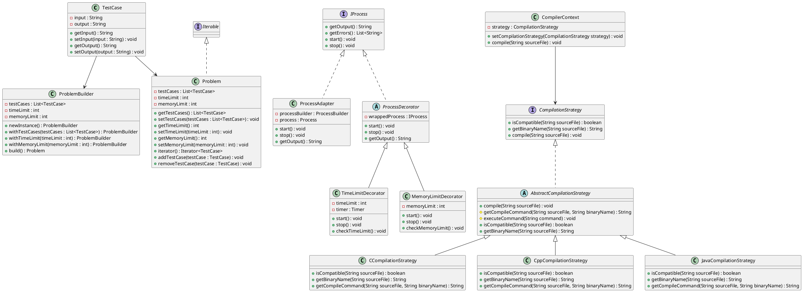

## Liste des tâches :

| Fonctionnalités                            | Auteur(s) | Patron de conception choisi |
| ------------------------------------------ |-----------|-----------------------------|
| Représentation d’un cas de test                 | Quentin   | Pas de patron indispensable |
| Représentation d'un problème    | Quentin   | Composite                   |
| Configuration d'un problème                   | Quentin   | Builder                     |
| Représentation d'un processus       | Quentin   | State                       |
| Limitation du temps d’exécution d’un processus     | Quentin   | Decorateur                  |
| Limitation de la mémoire d’un processus    | Quentin   |          Decorateur                   |
| Compilation d’un programme C               | Bylel     |             Stratégie                |
| Compilation d’un programme C++               | Bylel     |            Stratégie                 |
| Compilation d’un programme Java               | Bylel     |            Stratégie                 |
| Compilation d’un programme Python               | Bylel     |          Stratégie                   |
| Exécution d’un programme C compilé               | Axel      |           Stratégie                  |
| Exécution d’un programme C++ compilé         | Axel      |                 Stratégie            |
| Exécution d’un programme Java compilé            | Axel      |           Stratégie                  |
| Vérification stricte de la solution          | Isaac     |            Stratégie                 |
| Vérification avec tolérance sur les réels               | Isaac     |     Stratégie                        |
| Vérification avec tolérance sur la casse               | Isaac     |      Stratégie                       |
| Vérification avec tolérance sur les espaces                | Isaac     |     Stratégie                        |
| Vérification avec tolérance sur l’ordre             | Isaac     |           Stratégie                  |
| Vérification d’une solution parmi plusieurs               | Isaac     |      Stratégie                       |
| Vérification déléguée à un programme externe               | Isaac     |     Stratégie                        |
| Configuration de l’exécution sur un cas de test               | Axel      |          Pas de patron indispensable                   |
| Programme principal du juge automatique               | Axel      |                       Pas de patron indispensable      |

## Diagramme de classes : 

```plantuml
@startuml

class SingleProblem  {
    - name: String
    - language: String
    - testCases: List<String>
    + executeTests()
}

class CompositeProblem  {
    - name: String
    - problems: List<IProblemComponent>
    + add(component: IProblemComponent)
    + remove(component: IProblemComponent)
    + getChild(index: int): IProblemComponent
}

interface IProblemComponent {
    + add(component: IProblemComponent)
    + remove(component: IProblemComponent)
    + getChild(index: int): IProblemComponent
}


class ProblemBuilder {
    - name: String
    - language: String
    - testCases: List<String>
    + setName(name: String): ProblemBuilder
    + setLanguage(lang: String): ProblemBuilder
    + addTestCase(testCase: String): ProblemBuilder
    + build(): IProblemComponent
}

class Process {
    - state: IProcessState
    + setState(state: IProcessState)
    + execute()
}

interface IProcessState {
    + handle()
}

class RunningState {
    + handle()
}

class WaitingState {
    + handle()
}

class TerminatedState {
    + handle()
}

interface IProcessDecorator {
    + execute()
}

class TimedProcessDecorator {
    - process: Process
    - timeout: long
    + execute()
}

class MemoryLimitedProcessDecorator {
    - process: Process
    - memoryLimit: long
    + execute()
}

' Compiler Interface
interface ICompiler {
    + compile(sourceFile: String): void
}

' Specific implementations for each language
class JavaCompiler {
    + compile(sourceFile: String): void
}
class CCompiler {
    + compile(sourceFile: String): void
}
class CPPCompiler  {
    + compile(sourceFile: String): void
}
class PythonCompiler {
    + compile(sourceFile: String): void
}

' Judge uses a compiler
class Judge {
    - ICompiler compiler
    - IExecutor: executor
    - IVerify: verify
    + setCompiler(ICompiler): void
    + evaluate(sourceFile: String): void
    + setExecutor(e: Executor): void
    + execute(): void
    + setVerifier(verifier: IVerify)
    + verify(solution, expected): bool
}

interface IExecutor {
    + executeProgram(): void
}

class ExecutorC {
    + executeProgram(): void
}

class ExecutorCPP {
    + executeProgram(): void
}

class ExecutorJava {
    + executeProgram(): void
}

class ExecutorPython {
    + executeProgram(): void
}

interface IVerify {
    + verify(solution, expected): bool
}

class StrictVerify {
    + verify(solution, expected): bool
}

class RealToleranceVerify {
    + verify(solution, expected): bool
}

class CaseInsensitiveVerify {
    + verify(solution, expected): bool
}

class SpaceToleranceVerify {
    + verify(solution, expected): bool
}

class OrderToleranceVerify {
    + verify(solution, expected): bool
}

class MultipleSolutionsVerify {
    + verify(solution, expected): bool
}

class ExternalProgramVerify {
    + verify(solution, expected): bool
}

' Relationships

IVerify <|-- StrictVerify
IVerify <|-- RealToleranceVerify
IVerify <|-- ExternalProgramVerify
IVerify <|-- SpaceToleranceVerify
IVerify <|-- CaseInsensitiveVerify
IVerify <|-- OrderToleranceVerify
IVerify <|-- MultipleSolutionsVerify

JavaCompiler --|> ICompiler  : <<Implements>>
CCompiler --|> ICompiler : <<Implements>>
CPPCompiler --|> ICompiler : <<Implements>>
PythonCompiler --|> ICompiler : <<Implements>>
Judge --> ICompiler : <<Use>>
Judge --> Process : <<Manage>>
Judge --> IVerify : <<Use>>
Judge --> IExecutor : <<Use>>
IExecutor <|.. ExecutorC : <<Implements>>
IExecutor <|.. ExecutorCPP : <<Implements>>
IExecutor <|.. ExecutorJava : <<Implements>>
IExecutor <|.. ExecutorPython : <<Implements>>

IProcessDecorator <|.. TimedProcessDecorator : <<Decorate>>
IProcessDecorator <|.. MemoryLimitedProcessDecorator : <<Decorate>>
Process *-- IProcessDecorator : <<Decorate>>
Process *-- IProcessState : <<State>>
IProcessState <|.. RunningState  : <<Implements>>
IProcessState <|.. WaitingState : <<Implements>>
IProcessState <|.. TerminatedState : <<Implements>>

ProblemBuilder --> SingleProblem : <<Created>>
ProblemBuilder --> CompositeProblem : <<Created>>
ProblemBuilder <-- Judge : <<Use>>

SingleProblem --> IProblemComponent : <<Implements>>
CompositeProblem --> IProblemComponent : <<Implements>>

@enduml

```

Diagramme (Dernière MAJ : 22/10/23 13:03)

